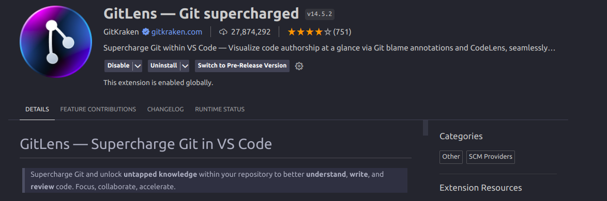
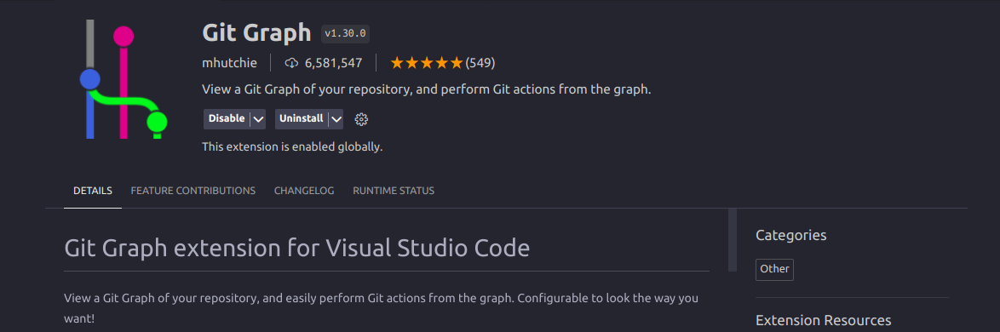
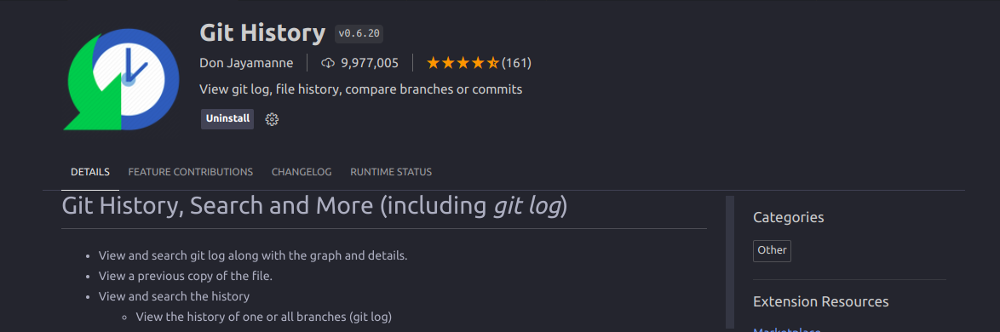

# Table of Contents

- [Table of Contents](#table-of-contents)
- [GIT / Github](#git--github)
  - [Git](#git)
  - [Github](#github)
- [Why is version control important](#why-is-version-control-important)
- [Git Workflow for Developers](#git-workflow-for-developers)
  - [1. Pull Latest Updates](#1-pull-latest-updates)
  - [2. Create a Feature Branch](#2-create-a-feature-branch)
  - [3. Staging and Committing Changes](#3-staging-and-committing-changes)
  - [4. Push Feature Branch](#4-push-feature-branch)
  - [5. Post Feature Branch Push](#5-post-feature-branch-push)
- [Resetting in Git: Strategies for Commit, Staging.](#resetting-in-git-strategies-for-commit-staging)
  - [1. Undo Last Staging](#1-undo-last-staging)
  - [2. Rename a Commit](#2-rename-a-commit)
  - [3. Reset to a Commit (Keep Changes)](#3-reset-to-a-commit-keep-changes)
  - [4. Reset to a Commit (Discard Changes)](#4-reset-to-a-commit-discard-changes)
- [Usuful Extentions (VSCode)](#usuful-extentions-vscode)
  - [1. GitLens](#1-gitlens)
  - [2. Git Graph](#2-git-graph)
  - [3. Git History](#3-git-history)
- [Best Practices](#best-practices)
    - [1. Write Meaningful Commit Messages:](#1-write-meaningful-commit-messages)
    - [2. Keep Commits Atomic:](#2-keep-commits-atomic)
    - [3. Use Feature Branches:](#3-use-feature-branches)
    - [4. Pull Before Push:](#4-pull-before-push)
    - [5. Use .gitignore:](#5-use-gitignore)
    - [6. Regularly Clean Up Branches:](#6-regularly-clean-up-branches)
    - [7. Review Changes Before Pushing:](#7-review-changes-before-pushing)
- [Usuful Links](#usuful-links)
- [Contributions](#contributions)

# GIT / Github

## Git

- Git is a distributed version control system (DVCS) that is widely used for tracking changes in source code during software development. It allows multiple developers to collaborate on a project, keeping track of their changes and managing different versions of the code.
- Git was created by Linus Torvalds in 2005 to manage the development of the Linux kernel.

## Github

- GitHub is a web-based platform that provides hosting for software development and version control using Git. It offers a range of collaborative features for developers, making it easier to work together on projects. GitHub is widely used for hosting and sharing code, managing projects, and facilitating collaboration among developers.

# Why is version control important

1. **History and Audit Trail:**

   - Version control systems maintain a complete history of changes, providing an audit trail for debugging and understanding the evolution of the code.

2. **Collaboration:**

   - Enables multiple developers to work on the same project concurrently, facilitating collaboration without interference.

3. **Branching and Parallel Development:**

   - Allows the creation of branches for independent development, supporting parallel work on features or bug fixes that can later be merged.

4. **Code Stability:**
   - Permits reverting to a stable state if new changes introduce issues, helping to maintain the stability of the codebase.

# Git Workflow for Developers

## 1. Pull Latest Updates

Before starting any development work, it's essential to ensure you have the latest updates from the repository. Use the following commands:

```bash
git pull origin main
```

This fetches the latest changes from the main branch of the remote repository and updates your local working copy.

## 2. Create a Feature Branch

To isolate your work and avoid directly modifying the main branch, create a new branch for your feature. Replace "feature-branch" with a descriptive name for your feature:

```bash
git checkout -b feature-branch #create and switch to branch
```

This command creates and switches to a new branch named "feature-branch."

or you can use this syntax

```bash
git branch feature-branch #create branch
git checkout feature-branch # switch to branch
```

## 3. Staging and Committing Changes

Make your changes to the code and stage them for commit. Here's a basic sequence:

```bash
# Stage all changes
git add .
# or
git add <file_path>
# Commit changes with a meaningful message
git commit -m "Implement new feature"
```

Repeat the staging and committing process as needed for your changes.

## 4. Push Feature Branch

Once your changes are committed locally, push the feature branch to the remote repository:

```bash
git push origin feature-branch # Origin Refers to the remote repository
```

## 5. Post Feature Branch Push

- **After pushing, GitHub will provide a link to create a pull request.**

1. Navigate to "Pull Requests" on GitHub:
   Go to your repository on GitHub and click on the "Pull Requests" tab.

2. Click on the "New Pull Request" button.

3. Select Branches:

   Choose the main branch as the base branch.
   Select your feature branch as the compare branch.

4. Add Details:
   Provide a brief title and description summarizing your changes.

5. Assign Reviewer:
   Assign a reviewer responsible for approving changes.

6. Create Pull Request:
   Click the "Create Pull Request" button to open the pull request for review.

7. **Wait for Merging:**

   The pull request enters a review phase.
   The assigned reviewer inspects changes, provides feedback, and approves for merging.

8. **Make Adjustments**:
   Be responsive to feedback, make necessary adjustments, and update the pull request.

9. **Merge Changes**:
   Once the reviewer is satisfied, they will merge your changes into the main branch.

**Congratulations! You've successfully contributed your feature through a
pull request!**

10. **Delete Local Branch**

    Once Branch is merged you should delete your local branch
    ```bash
    git branch -d feature_branch # This will delete local branch if merged Localy
    git branch -D feature_branch # This will delete local branch even if not merged Localy
    git pull origin main # finally pull latest update from remote repository
    ```


# Resetting in Git: Strategies for Commit, Staging.

When you make a new commit, Git stores a snapshot of your repository at that specific moment in time; later, you can use Git to go back to an earlier version of your project.

## 1. Undo Last Staging
```bash
git reset --mixed # this is the default when executing git reset
```
This will undo the last staging.

## 2. Rename a Commit
If there is a typo or want to modify the commit message.
```bash
git commit --amend
# or
git commit --amend -m "message"
```

## 3. Reset to a Commit (Keep Changes)
After staging and commiting your work you might want to go back to the previous commit

```bash
git reset --soft <commit_hash>

# use git log to get commit hash
git log
commit 55c396ac9e3f44510745a79466262df9025f0036 # this is the hash
Author: spikeoze <mukhtaaramiin@gmail.com>
Date:   Tue Dec 5 19:29:13 2023 +0300

    introduction and git workflow
```

This will keep the working in your directory and only reset to the commit specified.

## 4. Reset to a Commit (Discard Changes)
This will discard changes be cautious when using this command as it will discard changes after the commit you are resetting to.
```bash
git reset --hard  <commit_hash>
```


# Usuful Extentions (VSCode)

## 1. GitLens


GitLens is a powerful Visual Studio Code extension. It provides seamless navigation and powerful features to gain insights into who, why, and when a line or code block was changed.




## 2. Git Graph
Git Graph is an extension for Visual Studio Code that provides an interactive graphical representation of your repository's commit history and branches. It enhances understanding of your project's version control history with features like viewing commit changes, diffs, and performing git actions directly from the graph. It's a useful tool for visualizing the structure and progress of your development work.




## 3. Git History

Git History is an extension for Visual Studio Code that allows you to view git log along with the complete version history. It provides a clear and detailed view of the commit history and the changes made in each commit.

With Git History, you can view the details of any commit, compare changes between commits or branches, view a commit's metadata, or check out an older version of the code. It’s a useful tool for understanding the evolution of a project and tracking changes over time.

To use Git History, right-click on a file or folder in your workspace and select "View Git History". Then, you can select any commit from the history list to view the changes made in that commit.




---
# Best Practices

### 1. Write Meaningful Commit Messages:
- Clearly describe the purpose of each commit.

### 2. Keep Commits Atomic:
- Make each commit represent a single logical change.

### 3. Use Feature Branches:
- Create branches for new features or bug fixes.

### 4. Pull Before Push:
- Always pull changes before pushing to avoid conflicts.

### 5. Use .gitignore:
- Specify files/directories to be ignored.

### 6. Regularly Clean Up Branches:
- Delete branches that are no longer needed.

### 7. Review Changes Before Pushing:
- Review commits to avoid pushing unnecessary changes.


# Usuful Links
- [Atlassian Git Tutorial](https://www.atlassian.com/git): Comperhensive Resources on git.
- [Git Cheat Sheet](https://training.github.com/downloads/github-git-cheat-sheet.pdf): PDF file that containes useful git commands.
- [How to Undo Almost Anything](https://github.blog/2015-06-08-how-to-undo-almost-anything-with-git/): Common scenarios where you might want to “undo” a change you’ve made and the best way to do it using Git.

---
# Contributions

**Contributions are welcome!**
